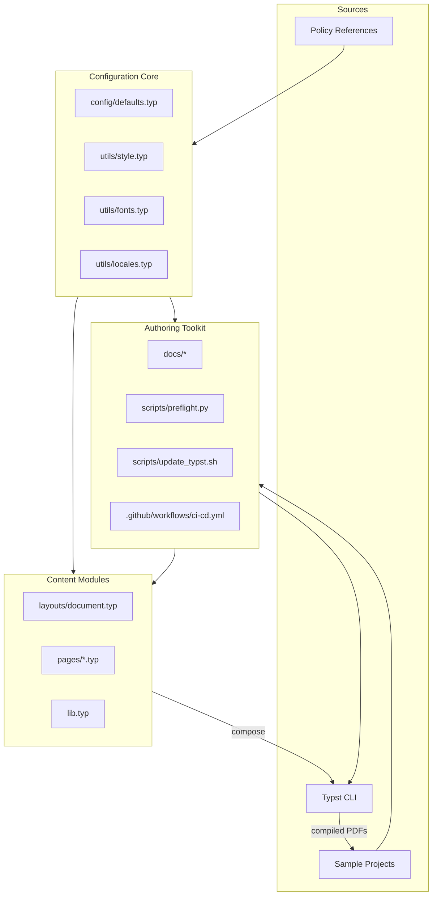

# design

This design translates the requirements in `docs/requirements.md` into implementable architecture and workflows for the University of Melbourne Typst thesis template. Requirement identifiers (e.g. R-FMT-001) trace each decision back to the spec and keep the system Kiro-aligned.

## Context
- The repository already contains Typst layout files, automation scripts, and sample theses. We will extend these assets to satisfy University policy (UoM-Prep, UoM-Pub, UoM-AI) while leveraging patterns from leading Typst templates (`Typst-UIT`, `Typst-UM`, `Typst-ThesIST`) and the existing LaTeX reference (`LaTeX-UoM`).
- Requirements cluster into six domains: page layout & front matter (R-FMT, R-FM), preface & declarations (R-PRE), publication integration (R-PUB), appendices & creative outputs (R-APP), integrity & editorial governance (R-AI, R-EDT), submission/readiness (R-SUB), and implementation scaffolding (R-IMP).

## Goals
1. Deliver a Typst project skeleton that enforces UoM layout, metadata, and policy constraints out of the box (R-FMT-001..005, R-FM-001..003).
2. Provide structured authoring flows for prefaces, declarations, publication metadata, and AI disclosures (R-PRE-001..003, R-AI-001..003, R-EDT-001..002).
3. Support “thesis-with-publications” scenarios through reusable macros, metadata registries, and end-matter/appendix tooling (R-PUB-001..006, R-APP-001..002).
4. Ship documentation, samples, and automation that guide candidates from draft through repository submission (R-IMP-001..010, R-SUB-001..002).

## Non-goals
- Building TES upload automation or Minerva repository integrations; we document processes instead (outside R-SUB scope).
- Creating bespoke Typst rendering engines; we configure existing Typst compiler features.
- Managing university approvals or policy updates beyond referencing official sources.

## Stakeholders & Users
- Graduate researchers authoring theses (primary users).
- Supervisors and advisory committees reviewing compliance.
- Template maintainers ensuring policy adherence and Typst compatibility.
- Tooling (CI, documentation readers) consuming generated artefacts.

## Architecture Overview
The solution layers three cooperating modules atop existing Typst assets:

1. **Configuration Core (`config/` + `utils/global.typ`)** — Centralises document metadata, typography, and layout constants. Satisfies R-FMT-001..004, R-FM-001..003, R-IMP-001..002.
2. **Content Modules (`frontmatter/`, `chapters/`, `endmatter/`)** — Provide structured templates, macros, and partials for front matter, preface, publications, and appendices/end matter. Covers R-PRE-001..003, R-PUB-001..004, R-APP-001..002, R-AI-001, R-OPT-DED-001, R-OPT-AUTH-001, R-OPT-GLOS-001, R-OPT-IDX-001.
3. **Authoring Toolkit (`docs/`, `scripts/`, `tasks/`)** — README updates, QA checklists, CLI helpers, and sample content supporting build workflows, disclosures, and submission checklists. Addresses R-PUB-005..006, R-AI-002..003, R-EDT-001..002, R-SUB-001..002, R-IMP-003..010.

Directory scaffold (R-STR-001):

```text
frontmatter/
  title.typ
  abstract.typ
  declaration.typ
  acknowledgements.typ
  preface.typ
  dedication.typ (optional)
  authorship.typ (optional statement of authorship)
  toc.typ (generates TOC/LOF/LOT/LOA)
chapters/
  chapter1-introduction.typ
  chapter2-literature.typ
  chapter3-methods.typ
endmatter/
  appendix-a.typ
  appendix-b.typ
  bibliography.typ
  glossary.typ (optional)
  index.typ (optional)
```



Interactions:
- Metadata defined in the configuration core is injected into front matter generators and reused across preface, declaration, and status registers (traceable to R-FM-001, R-PRE-002, R-PUB-003).
- Publication macros emit footnotes, appendices, and status tables using a shared registry, ensuring consistent updates when statuses change (R-PUB-002..004).
- Documentation and scripts consume the same registries to build submission checklists and iThenticate declaration templates (R-PUB-005, R-SUB-001).

## Component Design

### 1. Layout & Typography Layer
- **Typst config file (`layouts/unimelb.typ`)** sets `paper: a4`, margin variables, mirrored inner margins toggled via `print-ready` flag (R-FMT-001, R-FMT-002).
- **Declaration template** uses Typst content blocks without signature placeholders and surfaces word-count placeholders (R-FMT-004, R-PRE-003).
- **Asset policy guard**: configuration exports a boolean `allow-official-logo = false`; documentation explains policy (R-FMT-003).

### 2. Front Matter Generator
- Expose metadata structure:
  ```typst
  #let thesis-meta = (
    title: "",
    creative-titles: (),
    candidate: (
      legal-name: "",
      orcid: "",
    ),
    degree: (
      name: "",
      faculty: (),
      departments: (),
      submission: datetime(..),
      resubmission: none,
    ),
    keywords: (),
  )
  ```
  (R-FM-001, R-IMP-002).
- Abstract macro enforces word count via compile-time validation (`assert(words >= 300 && words <= 500)`) and prompts for creative output descriptions (R-FM-002, R-APP-002).
- Acknowledgements block contains structured tables for funding and RTP text (R-FM-003).

### 3. Preface, Declaration & Assistance Modules
- Preface builder accepts contribution entries:
  ```typst
  #preface(contributions: contributions-table,
           publication-registry: publications,
           ai-log: ai-entries,
           third-party-assistance: assistance-entries)
  ```
  (R-PRE-001, R-PRE-002, R-AI-001, R-EDT-001).
- Provide pre-made tables for contribution percentages and AI log fields (tool, purpose, dates, prompt, verification) (R-IMP-003, R-AI-001).
- Declaration generator reuses metadata to state word count and dissertation/creative output split (R-PRE-003).

### 4. Publication Integration Toolkit
- Maintain a `#let publications = ()` registry with entries containing citation, status, consent flags, iThenticate inclusion, appendix linkage (R-PUB-001..006).
- Macros:
  - `#include-publication(pub-id, reuse: "verbatim" | "adapted", appendix: bool)` — emits chapter footnote and handles bibliography suppression (R-PUB-002).
  - `#publication-status-table(publications)` — surfaces in preface and appendices (R-PRE-002, R-PUB-003).
  - `#literature-gap-reminder()` — optional snippet reminding authors to supplement reviews (R-PUB-004).
- Appendices macros ensure supportive content only and allow creative output linking (`#creative-output(description, url, media-type)`) (R-APP-001..002).

### 5. Documentation & Automation
- **README / docs updates** include:
  - Submission checklist referencing originality report and declaration uploads (R-SUB-001).
  - Final repository packaging guidance referencing Minerva specs (R-SUB-002).
  - iThenticate workflow with optional appendix template (R-PUB-005).
  - AI confidentiality warning and citation footnote examples (R-AI-002..003).
  - Editorial assistance boundaries summarizing ASEP standards (R-EDT-001..002).
- **CLI scripts / tasks** (optional) provide convenience commands: `typst compile`, `typst watch`, `cleanup`. Documented in tasks or README (R-IMP-008).
- **Sample content** (under `samples/`) demonstrates figures, tables, publications, AI disclosures, and QA checklist referencing requirement IDs (R-IMP-004..010).

## Data & Configuration Models
| Structure | Purpose | Requirements |
|-----------|---------|--------------|
| `thesis-meta` tuple | Central metadata store for front matter | R-FM-001..003, R-IMP-002 |
| `publications` array | Each entry: `{id, citation, status, consent, reuse, appendix-ref}` | R-PRE-002, R-PUB-001..004 |
| `ai-log` array | `{tool, purpose, prompts, dates, verification}` | R-AI-001..003 |
| `assistance` array | `{party, expertise, scope}` | R-PRE-001, R-EDT-002 |
| `appendix-items` array | Tracks supportive artefacts and creative links | R-APP-001..002 |

## Feature Matrix

| Feature Area | Requirements | Policy / Template Inputs | Existing Assets | Planned Enhancements |
| --- | --- | --- | --- | --- |
| Layout & Pagination Controls | R-FMT-001, R-FMT-002, R-FMT-005 | UoM-Prep §3.4–3.5, §3.8(i–j); Typst-UIT layout conventions | `layouts/document.typ`, `utils/style.typ`, `lib.typ` | Add `layouts/unimelb.typ` with enforced A4 margins, print-ready mirror toggles, auto list generation macros tied to tagged elements |
| Branding & Declaration Compliance | R-FMT-003, R-FMT-004, R-PRE-003 | UoM-Prep §3.6–3.7, §3.10; LaTeX-UoM declaration pattern | `thesis.typ`, `layouts/document.typ` | Export signature-free declaration block, spine text helper, no-logo guard flag documented in README |
| Metadata & Title Page Orchestration | R-FM-001..003 | UoM-Prep §3.8–3.9; Typst-UM metadata form | `thesis.typ`, `sample-chapter.typ` | Centralise metadata in `config/defaults.typ`, add validation hints, funder table partial, ORCID field |
| Preface & Contribution Logging | R-PRE-001, R-PRE-002, R-IMP-003 | UoM-Prep §3.11; UoM-Pub “The preface”, “Declaration of incorporated publications” | `sample-chapter.typ`, `thesis.typ` preface stub | Provide contribution matrix macro, publication status register, reusable narrative prompts for prior work and assistance |
| Publication Integration Workflow | R-PUB-001..006 | UoM-Prep §3.14–3.19; UoM-Pub Overview, Format, Completing the forms, iThenticate; declaration form | `sample-chapter.typ`, `pages/landscape-sample.typ` | Build publication registry, chapter footnote macro, appendix inclusion helper, iThenticate declaration template and TES upload checklist |
| End Matter & Creative Outputs | R-APP-001, R-APP-002, R-OPT-GLOS-001, R-OPT-IDX-001 | UoM-Prep §3.13, §3.18–3.19; UoM-Pub examples; Typst-ThesIST appendix handling | `pages/landscape-sample.typ`, `sample-chapter.typ` | Add `appendix-items` struct, creative output descriptor macro, optional glossary/index hooks, and validation ensuring end matter follows bibliography |
| Digital Assistance & Editorial Governance | R-AI-001..003, R-EDT-001, R-EDT-002 | UoM-Prep §3.21–3.24; UoM-AI statement; ASEP Standards C–E | `README.md`, `docs/requirements.md` | Embed AI log and assistance tables in preface, add confidentiality warning callouts, summarise ASEP scope in docs |
| Submission & Repository Support | R-PUB-005, R-PUB-006, R-SUB-001, R-SUB-002 | UoM-Prep §3.1, §3.25–3.26; UoM-Pub “Completing the forms”, “iThenticate report”; declaration form guidance | `README.md`, `automate.sh`, `docs/source-material/` references | Publish submission checklist, TES packaging guidance, final archive instructions, script hooks for watch/clean commands |
| Implementation Scaffolding & Samples | R-IMP-001..010 | Typst-UIT project structure; Typst-UM and ThesIST usage docs; LaTeX-UoM feature set | `thesis.typ`, `lib.typ`, `sample-chapter.typ`, `scripts/` directory | Introduce modular `config/` layer, sample chapters illustrating figures/publications/AI notes, CLI build recipes, abbreviation helpers |
| Font Theme Profiles | R-FNT-001 | Typst-UIT font bundles; Typst-UM multilingual defaults | `utils/style.typ`, `layouts/document.typ` | Provide toggleable serif/sans font stacks with fallbacks, document selection API, enforce accessibility checks |
| Preflight QA Tooling | R-QA-001 | ThesIST build tooling patterns | `scripts/`, `.github/workflows/ci-cd.yml` | Ship CLI (shell or Python) to run compile, metadata validation, appendix ordering checks; integrate into CI |
| Localised Labels & Internationalisation | R-LOC-001 | Typst-UM localisation, UoM-Prep English-summary requirement | `thesis.typ` label strings | Add translation dictionaries with English fallback, expose metadata flag to select locale, ensure English summary retained |
| Build Profiles (Draft/Screen/Print) | R-BLD-001 | Typst CLI profile usage; modern-uit print guidance | `automate.sh`, `layouts/document.typ` | Create profile presets adjusting margin mirroring, image quality, watermarking, compile via CLI flags |
| Sample Library Expansion | R-SMP-001 | modern-uit/thesist examples | `sample-chapter.typ`, `pages/` assets | Add dedicated sample chapters for publications, creative outputs, AI disclosures, funding acknowledgements, QA checklist |
| Bibliography Style Presets | R-BIB-001 | modern-uit IEEE default; LaTeX-UoM style toggles | `lib.typ`, `thesis.typ` bibliography config | Offer preset citation styles (numeric, author–year, IEEE) selectable via metadata, document usage |
| CI/CD Automation | R-CI-001..003 | GitHub Actions best practice; Typst release cadence | `.github/workflows`, `scripts/` | Implement profile matrix builds, scheduled compatibility audits, and automated Typst upgrade helper scripts with changelog surfacing |

Configuration defaults live in `config/defaults.typ`; users override via local config file loaded before `show: thesis.with(...)` (R-IMP-001, R-IMP-002).

### Extended Feature Delivery
- **Font theme profiles (R-FNT-001)**: Inspired by modern-uit’s Open Sans/XCharter stack and modern-um’s multilingual support, expose toggleable serif/sans presets with accessible fallbacks, integrate contrast checks, and document override hooks.
- **Preflight QA tooling (R-QA-001)**: Provide a command (e.g., `scripts/preflight.sh`) that runs `typst compile`, verifies metadata completeness, appendix ordering, bibliography status, and AI log population; wire the command into CI and developer docs.
- **Localized labels (R-LOC-001)**: Ship translation dictionaries for chapter headings, abstract labels, and table/figure captions with an English fallback ensuring English summaries remain per policy.
- **Build profiles (R-BLD-001)**: Add `draft`, `screen`, and `print` presets that wrap Typst CLI flags and adjust margin mirroring, watermarking, and asset compression for faster iteration vs archival output.
- **Expanded sample chapters (R-SMP-001)**: Include ready-made examples covering publication integration, creative outputs, AI disclosure footnotes, funding acknowledgements, and QA checklist usage to accelerate author onboarding.
- **Bibliography style presets (R-BIB-001)**: Offer preconfigured citation styles (numeric, author–year, IEEE) exposed via metadata, and note discipline-specific recommendations in docs.
- **CI/CD automation (R-CI-001..003)**: Maintain workflows for matrix builds, scheduled Typst compatibility audits, and an upgrade helper script that raises pull requests with changelog summaries.

## Workflows

### Author Setup
1. Copy template skeleton (`scripts/new-project.sh` or documentation instructions) (R-IMP-001..002).
2. Populate `thesis-meta`, funding block, and abbreviations list (R-FM-001..003, R-IMP-005).
3. Register publications and AI logs; run `typst watch` to preview (R-PRE-001..002, R-AI-001).

### Publication Chapter Flow
1. Author adds entry to `publications` registry (R-PUB-001).
2. Insert `#include-publication` macro at chapter start with footnote metadata (R-PUB-002).
3. Optionally add full publication to end-matter appendices via `appendix-items` (R-APP-001).
4. Update status single-source-of-truth; rebuild to refresh preface tables (R-PUB-003).
5. Add supplementary literature review sections per snippet guidance (R-PUB-004).

### Preface & Declaration Workflow
1. Use provided tables to log contributions and third-party assistance (R-PRE-001, R-EDT-002).
2. Populate AI log table; include confidentiality warning reference (R-AI-001..003).
3. Declaration macro auto-populates from `thesis-meta` and displays word counts/percentages (R-PRE-003).

### Submission Checklist
1. Run iThenticate; record exclusions in provided appendix template (R-PUB-005).
2. Combine signed declaration forms externally; upload to TES (R-PUB-006, R-SUB-001).
3. Produce final PDF and archive per repository guidelines; follow README packaging instructions (R-SUB-002).

## Implementation Strategy
1. **Scaffold metadata & layout** — create `config/defaults.typ`, enforce margins, update title/declaration macros (R-FMT, R-FM, R-PRE-003).
2. **Build registries & macros** — implement publication, AI, and end-matter helpers (R-PRE, R-PUB, R-APP, R-AI).
3. **Extended feature implementation** — deliver font themes, localisation dictionaries, build profiles, expanded samples, bibliography presets, and automation hooks (R-FNT-001, R-LOC-001, R-BLD-001, R-QA-001, R-SMP-001, R-BIB-001, R-CI-001..003).
4. **Update documentation & onboarding** — README sections, QA checklist, font/profile usage guides, localisation notes, sample walkthroughs, CI usage (R-IMP, R-SUB, R-EDT, R-CI-001..003).
5. **Automate quality gates** — integrate preflight tooling, run multi-profile compiles, execute metadata/bibliography lint checks, and align with CI/CD (R-QA-001, R-CI-001).
6. **Future-proof Typst API adoption** — add scripts and workflows to track Typst releases, execute compatibility tests against latest CLI, and surface migration guidance in docs (R-CI-002, R-CI-003).

## Validation Plan
- **Compile checks**: CI runs `typst compile` across default, draft, screen, and print profiles using sample projects (R-CI-001, R-BLD-001).
- **Preflight automation**: Preflight script validates metadata completeness, appendix ordering, publication registry status, AI log coverage, and bibliography style selection (R-QA-001).
- **Policy assertions**: Typst assertions for margins, abstract length, publication status enumerations, and English-summary presence (R-FMT-001, R-FM-002, R-PRE-002, R-LOC-001).
- **Manual QA checklist**: Documented list covering AI log completion, publication consents, submission artefacts, localisation review, and bibliography style choice (R-PUB-005..006, R-AI-001, R-BIB-001).
- **API drift watch**: Scheduled CI job compiles against the latest Typst release and reports breaking changes or deprecated API usage (R-CI-002).

## Risks & Mitigations
| Risk | Impact | Mitigation |
|------|--------|------------|
| Policy changes from UoM | Out-of-date templates | Keep `docs/source-material/` references dated; add README note on verifying latest versions |
| Typst version drift | Build failures | Schedule CI job to test against newest Typst CLI, maintain `scripts/update_typst.sh` for automated bumps, pin minimum version in README |
| Users bypass registries | Missing disclosures | Provide default warnings, compile-time assertions, and preflight checks flagging empty registries when publications/appendices exist |
| Overly rigid validations | False failures for edge cases | Allow override flags with documented rationale (e.g., disable abstract length check via `allow-short-abstract` when policy permits) |
| Localisation divergence | Inconsistent labelling | Maintain translation tests and fallback to English; document governance for community contributions |

## CI/CD & Typst API Evolution
- **GitHub Actions matrix builds** compiling sample projects across all build profiles and Typst versions (current pinned + latest release).
- **Scheduled compatibility audit** running nightly/weekly against the newest Typst CLI and reporting API warnings or failures.
- **Automated dependency bump** script (`scripts/update_typst.sh`) that fetches new Typst releases, updates lockfiles/config, and opens pull requests with changelog summaries.
- **Preflight integration** ensuring QA tooling runs on every push and PR, with artefacts uploaded for inspection (PDFs, logs).
- **API change watchlist** documented in `docs/` noting deprecated Typst features and migration timelines.

## Open Questions
1. Should preflight tooling be implemented in shell, Python, or Typst itself to maximise cross-platform usage? (Impacts CI integration effort.)
2. What governance process will manage new translation contributions to ensure accuracy and policy alignment?
3. Can we automate TES evidence packaging (e.g., zipped bundle) without violating submission rules, or should guidance remain manual? (Impacts R-SUB-001.)
